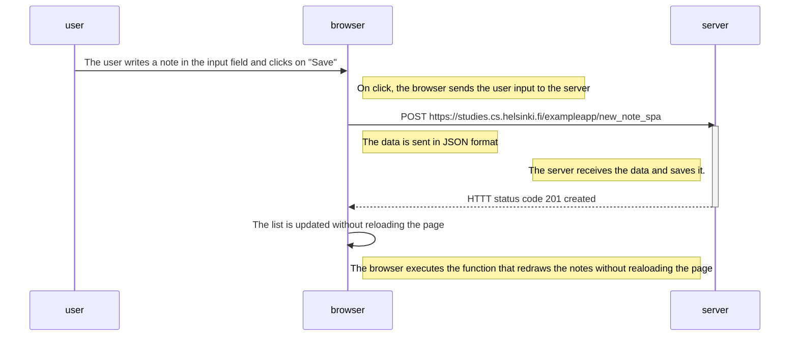

```mermaid
sequenceDiagram
    participant user
    participant browser
    participant server

    user->>browser: The user writes a note in the input field and clicks on "Save"

    Note right of browser: On click, the browser sends the user input to the server

    browser->>server: POST https://studies.cs.helsinki.fi/exampleapp/new_note_spa
    activate server
    Note right of browser: The data is sent in JSON format
    Note left of server: The server receives the data and saves it.

    server-->>browser: HTTT status code 201 created
    deactivate server

    browser->>browser: The list is updated without reloading the page

    Note right of browser: The browser executes the function that redraws the notes without realoading the page

```
  